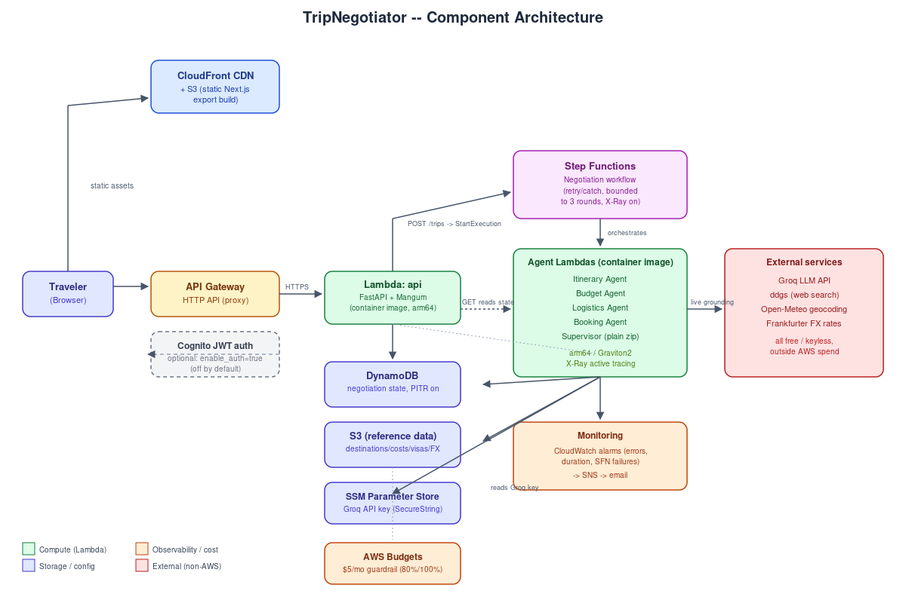
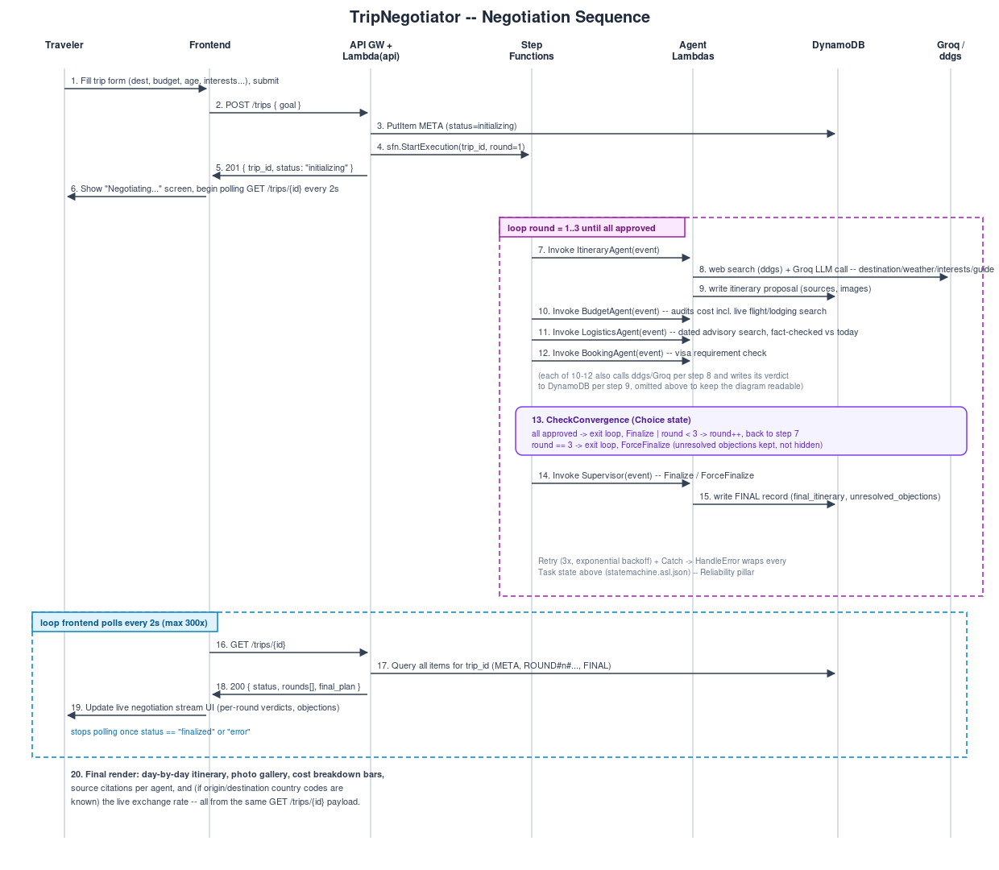

# TripNegotiator — Multi-Agent Trip Planning System

## Overview

**TripNegotiator** is a cloud-native, multi-agent system that plans trips through simulated negotiation between specialist AI agents. This is the course project for CSCI 5411: Advanced Cloud Architecting (Summer 2026).

### Key Features

- **Multi-agent negotiation**: specialist agents (Itinerary, Budget, Logistics, Booking, Supervisor) negotiate iteratively over a trip plan, each grounded in live web search (destination info, weather, per-interest highlights, a "best time to visit / practical essentials / etiquette / safety" guide, flight/lodging cost estimates, and date-fact-checked travel advisories) rather than the LLM's own unverified priors.
- **Bounded negotiation loop**: max 3 rounds -> guaranteed termination, with unresolved objections surfaced honestly rather than hidden if the cap is hit.
- **Personalization**: itinerary pacing tailored to the traveler's age, a location-picker autocomplete (Open-Meteo geocoding) instead of free-typed city names, and live origin-to-destination exchange rates (Frankfurter API) when both resolve to ISO country codes.
- **Sourced & visual**: every agent's verdict carries the live sources it was grounded in, plus a destination photo gallery.
- **Serverless on AWS**: API Gateway -> Lambda (container image, arm64/Graviton2) -> Step Functions -> per-agent Lambdas -> DynamoDB/S3, with CloudWatch alarms, X-Ray tracing, and an AWS Budgets guardrail. See `docs/architecture.svg` / `docs/sequence.svg`.
- **Infrastructure as Code**: Terraform-managed, with a documented bootstrap order for the container-image Lambdas (see Deployment below).
- **CI/CD**: GitHub Actions workflow (lint -> test -> build/push Lambda image -> `terraform apply`) -- see the CI/CD Status section on whether it's actually been exercised yet.

---

## Project Structure

```
trip-negotiator/
├── agents/                     # Lambda handlers, one per negotiation agent
│   ├── itinerary_agent/
│   ├── budget_agent/
│   ├── logistics_agent/
│   ├── booking_agent/
│   └── supervisor/
│   # agents/trip_init/ is RETIRED -- see its handler.py docstring. The
│   # FastAPI app in api/main.py is the real HTTP entrypoint now.
├── api/
│   └── main.py                 # FastAPI app; also the Lambda entrypoint (Mangum) behind API Gateway
├── frontend/                   # Next.js frontend (TypeScript + Tailwind, static export)
│   └── src/
│       ├── app/                 # Pages/layout
│       ├── components/          # TripForm, NegotiationProgress, LocationAutocomplete, TripHistory
│       └── lib/                 # API client
├── shared/                     # Shared Python utilities
│   ├── groq_client.py           # Groq LLM API integration
│   ├── dynamo_utils.py          # DynamoDB operations
│   ├── s3_utils.py              # S3 reference data access (with local-file fallback)
│   ├── web_search.py            # ddgs-backed web search (+ SearxNG opt-in, DuckDuckGo scrape last resort)
│   ├── dynamic_data.py          # Higher-level "get me grounded info about X" search functions
│   └── currency_utils.py        # Country -> currency -> live FX rate (Frankfurter)
├── data/                        # Static reference/fallback data (destinations, costs, visas, seasonal notes, currencies)
├── infra/                       # Terraform IaC
│   ├── main.tf, variables.tf, outputs.tf, iam.tf, terraform.tf
│   ├── ecr.tf                   # Container image repo backing the app Lambdas
│   ├── lambda.tf                # api + 4 agent Lambdas (container image, arm64) + supervisor (zip)
│   ├── apigateway.tf            # HTTP API, proxied to the api Lambda; POST /trips optionally gated by Cognito
│   ├── stepfunctions.tf, statemachine.asl.json
│   ├── cognito.tf               # User pool + JWT authorizer (on by default, var.enable_auth)
│   ├── dynamodb.tf              # PITR + encryption explicit
│   ├── s3.tf                    # Reference-data bucket + lifecycle rules
│   ├── frontend.tf               # S3 + CloudFront for the static frontend
│   ├── monitoring.tf             # CloudWatch alarms + SNS topic
│   └── budgets.tf                # AWS Budgets guardrail (may be blocked by Learner Lab IAM -- see file comment)
├── Dockerfile.lambda            # Shared image for the container-based Lambdas
├── build-lambda-image.sh/.bat   # Build + push that image to ECR
├── tests/                       # pytest suite
├── .github/workflows/deploy.yml # CI/CD pipeline
├── docs/                        # architecture.svg, sequence.svg (real diagrams, not ASCII art)
├── deploy-frontend.sh/.bat, deploy-all.sh/.bat
└── README.md
```

---

## Architecture





Source SVGs are in `docs/architecture.svg` and `docs/sequence.svg` if you need to edit them.

**The short version:** the frontend (Next.js, static-exported to S3 + CloudFront) calls a single API Gateway HTTP API, proxied entirely to one Lambda -- `api/main.py`, a FastAPI app wrapped in Mangum. `POST /trips` writes the trip's metadata to DynamoDB and starts a Step Functions execution; the state machine calls the four negotiation-agent Lambdas in sequence (each one live-grounded via Groq + `ddgs` web search), loops back up to 3 times on any rejection, then calls a Supervisor Lambda to finalize. The frontend polls `GET /trips/{id}` (also served by the same `api` Lambda, reading straight from DynamoDB) until the trip is finalized.

Locally, `local_api_server.py` runs the exact same `api/main.py` app with an in-memory DynamoDB mock and no Step Functions -- trip creation instead runs the negotiation loop in-process via a FastAPI `BackgroundTask`, calling the same agent handler functions directly. This is intentional and documented in `api/main.py`'s own docstring: one codebase, two orchestration paths, selected automatically by whether `STATE_MACHINE_ARN` is set in the environment.

---

## Prerequisites

- **AWS Account**: AWS Academy Learner Lab or equivalent access
- **Groq API Key**: free tier at https://console.groq.com
- **Terraform**: v1.0+
- **Docker**: needed to build the Lambda container image (see Deployment)
- **Python**: v3.11+
- **Node.js**: v18+ (frontend)
- **Git**: for version control

---

## Local Development (no AWS needed)

```bash
pip install -r requirements.txt
python local_api_server.py          # http://localhost:3001, interactive docs at /docs

cd frontend
npm install
npm run dev                          # http://localhost:3000
```

This is the fastest loop for iterating on agent prompts, search grounding, or UI -- it exercises the real `api/main.py` and real agent handlers against a real (free) Groq account and real web search, just without touching AWS.

---

## Deployment to AWS

Deployment is **not a single `terraform apply`** -- the app Lambdas are container images, and a Lambda can't be created pointing at an image that doesn't exist in ECR yet. Bootstrap order:

```bash
# 1. Create just the ECR repo
cd infra
terraform init
terraform apply -target=aws_ecr_repository.lambda_image

# 2. Build & push the Lambda image (from repo root)
cd ..
bash build-lambda-image.sh      # or build-lambda-image.bat on Windows

# 3. Now create everything else, including the Lambdas that reference that image
cd infra
terraform apply

# 4. Deploy the frontend
cd ..
bash deploy-frontend.sh         # or deploy-frontend.bat
```

`terraform.tfvars` needs `groq_api_key` and `cognito_user_email` set (see `terraform.tfvars.example`) -- it's gitignored, so this file stays local-only.

For future code changes: re-run steps 2-3 (rebuild/push the image, `terraform apply` again) -- no need to redo step 1.

**As of this report, this has not yet been run against a real AWS account from this environment** (no AWS credentials configured here) -- the infrastructure code is believed correct (every `.tf` file has been checked for balanced braces/structure, but not run through `terraform validate`/`plan` against real AWS) and needs to actually be applied and verified end-to-end on your machine/Learner Lab account before the report can claim it works.

---

## CI/CD Status

`.github/workflows/deploy.yml` runs: lint (flake8) -> `pytest tests/` -> (on PR) `terraform plan` -> (on push to `main`) build & push the Lambda image -> `terraform apply`.

**This pipeline has not yet actually executed** -- the local git repository has no `git remote` configured, so nothing has ever been pushed to GitHub, and GitHub Actions has never triggered. Before the report is finalized: create a GitHub repo, `git remote add origin <url>`, `git push`, add the `AWS_ACCESS_KEY_ID` / `AWS_SECRET_ACCESS_KEY` / `AWS_SESSION_TOKEN` secrets (Learner Lab credentials, which expire -- CI runs against a live Lab session will need fresh secrets), and confirm a run goes green.

---

## AWS Services & Cost

| Service | Usage | Cost Model |
|---------|-------|-----------|
| Lambda | `api` + 4 agents (container image, arm64) + supervisor (zip) | Pay-per-invocation, ~20% cheaper on arm64 |
| ECR | Stores the shared Lambda container image | Storage + data transfer, lifecycle policy expires untagged images after 7 days |
| Step Functions | Negotiation orchestration | Standard workflow, pay-per-transition |
| DynamoDB | On-demand negotiation state, PITR enabled | On-demand billing |
| S3 (x2) | Reference data + frontend static site | Standard + requests, lifecycle rules expire old versions after 30 days |
| API Gateway | HTTP API endpoint | Pay-per-request |
| CloudFront | Frontend CDN | PriceClass_100 (US/Europe/Japan only) |
| Cognito | User pool (provisioned, auth enforcement on by default) | Free tier (50K MAUs) |
| CloudWatch + X-Ray | Alarms, logs (7-day retention), traces | Low-volume, mostly free-tier |
| SNS | Alarm/budget notifications | Free tier |
| SSM Parameter Store | Groq API key (SecureString) | Free (standard tier) |
| AWS Budgets | $5/mo guardrail, 80%/100% thresholds | Free (may be blocked by Learner Lab IAM -- see `infra/budgets.tf`) |
| **Groq (external, non-AWS)** | Multi-round LLM calls | Pay-per-token, free tier available |

**AWS Learner Lab credit budget:** 45 credits. No real deployment has happened yet from this environment, so there's no actual spend to report -- the `infra/budgets.tf` guardrail is set to page at $5/month once real usage starts.

---

## Security Considerations

### Implemented

- SSM SecureString for the Groq API key, no hardcoded secrets in code
- S3 buckets (both) block all public access; CloudFront uses Origin Access Control, not a public bucket
- DynamoDB point-in-time recovery + encryption at rest, explicit in Terraform
- API Gateway CORS restricted to the real CloudFront domain + `localhost:3000`, not `*`
- Cognito user pool + a public (no-secret) SPA app client + a JWT authorizer are fully provisioned and wired to `POST /trips`
- **Auth enforcement is on by default** (`var.enable_auth = true`). The frontend implements a real sign-up/email-confirm/sign-in/sign-out flow against the Cognito user pool via SRP auth (`amazon-cognito-identity-js`, no Hosted UI redirect needed -- see `frontend/src/lib/auth.ts` and `frontend/src/components/LoginForm.tsx`). Once signed in, the SPA attaches the Cognito ID token as a `Bearer` header on every API request (`frontend/src/lib/api.ts`); `POST /trips` is rejected with 401 without a valid token. Local dev against `local_api_server.py` skips the login screen entirely (`frontend/.env.local` leaves the Cognito vars blank, which `AUTH_ENABLED` in `auth.ts` treats as "auth disabled") since the local dev server never checks a JWT anyway.

### Explicitly deferred (documented, not silently skipped)

- **IAM is the shared Learner Lab `LabRole`** for every resource, not per-function least-privilege roles -- a Learner Lab constraint, not a design choice. Production would give each Lambda a scoped role (e.g. the `itinerary_agent` role would only need `dynamodb:PutItem`/`GetItem` on this one table and `ssm:GetParameter` on the Groq key, nothing else).
- **AWS Budgets may not deploy at all** under LabRole (Budgets is commonly blocked in Learner Lab IAM policies) -- see the comment in `infra/budgets.tf`.

---

## AWS Well-Architected Framework Mapping

| Pillar | Concrete evidence in this repo |
|---|---|
| **Operational Excellence** | Structured logging throughout (`shared/logging_utils.py`); CloudWatch alarms on every Lambda's error rate and p95 duration plus Step Functions execution failures (`infra/monitoring.tf`), notifying an SNS topic; X-Ray active tracing on all Lambdas and the state machine; API Gateway access logs |
| **Security** | SSM SecureString secret storage; S3 public-access-block on both buckets; restricted CORS; Cognito user pool + JWT authorizer enforced on `POST /trips`, with a real SRP sign-up/sign-in flow in the frontend (see Security section above for what's still deferred and why) |
| **Reliability** | Bounded 3-round negotiation loop with graceful force-finalize (never hangs, never silently drops objections); Step Functions `Retry`/`Catch` with exponential backoff on every Task state; DynamoDB point-in-time recovery; every external web-search/LLM call has a fallback chain (`ddgs` -> SearxNG (opt-in) -> DuckDuckGo scrape -> static reference JSON) so a single upstream outage degrades rather than crashes a negotiation round |
| **Performance Efficiency** | On-demand DynamoDB (no capacity planning); Lambda memory tuned per function (256MB for light functions, 512MB for LLM/search-heavy ones); CloudFront edge caching for the frontend |
| **Cost Optimization** | Pay-per-request DynamoDB and API Gateway; arm64/Graviton2 Lambdas (~20% cheaper); S3 lifecycle rules expiring old object versions; ECR lifecycle policy expiring untagged images; AWS Budgets $5/mo guardrail with 80%/100% alerts; Groq's free tier keeps LLM cost outside the AWS bill entirely |
| **Sustainability** | arm64/Graviton2 Lambdas (AWS reports meaningfully lower energy per request than x86_64 for equivalent work) is this project's primary concrete decision here; fully serverless (Lambda + Step Functions) means zero idle compute between negotiations; region is pinned to `us-east-1` for Learner Lab compatibility -- `infra/variables.tf` documents that a production deployment would weigh a lower-carbon-intensity region (e.g. `us-west-2`) against latency/compliance needs |

This table replaces an earlier version of this README that asserted "Full AWS Well-Architected compliance" -- that was aspirational, not evidenced. The table above is meant to be checked against the actual `.tf`/`.py` files it cites, not taken on faith.

---

## Functional & Non-Functional Requirements

### User Stories

1. As a traveler, I want to submit my budget, trip length, interests, and age so the system proposes an itinerary genuinely tailored to all of them -- not just a generic city guide with my interests mentioned in passing.
2. As a traveler, I want the budget agent to catch cost overruns (including realistic flight costs from my actual origin) and revise the plan automatically.
3. As a traveler, I want to see why a proposal was rejected at each round, with the live sources behind each agent's reasoning, so I can judge whether I trust the verdict.
4. As a traveler, I want to view my past trip negotiations (full round-by-round history) after the fact.
5. As a traveler, I want to pick my origin/destination from real place suggestions (not free-typed strings that might not resolve) and see the current exchange rate between them if they're in different countries.
6. As a traveler, I want travel advisories to reflect what's actually true today, not a years-old resolved warning presented as current.

### Non-Functional Requirements

- **Scalability:** Lambda scales horizontally per-invocation; on-demand DynamoDB scales without capacity planning
- **Availability:** Step Functions persists execution state across Lambda failures; `Retry`/`Catch` on every task handles transient errors without failing the whole negotiation
- **Latency:** target <30s for a 3-round negotiation (Groq's inference speed is the main lever here)
- **Durability:** DynamoDB point-in-time recovery (35-day restore window); S3 versioning + lifecycle rules
- **Security:** see Security Considerations above
- **Maintainability:** one Lambda handler per agent, shared utilities (`shared/`) avoid duplicated search/DB/currency logic; a single container image backs all five app Lambdas so a dependency bump is one image rebuild, not five

---

## Demo Script (One-on-One Meeting)

1. Submit a trip request deliberately over-budget (guarantees a Budget Agent rejection) and one with an unusual interest mix (e.g. nightlife + museums) to show genuinely tailored, per-interest itinerary content.
2. Show the live negotiation stream in the UI: round 1 rejection -> round 2 revision -> approval, each with its sources.
3. Open the DynamoDB table and Step Functions execution graph side by side -- same data, two views.
4. Show a CloudWatch alarm (or force one, e.g. by temporarily breaking the Groq key) to demonstrate the SNS notification path.
5. Show the X-Ray trace for one negotiation, pointing out which agent Lambda actually dominates round latency.
6. Name the LabRole/IAM and Cognito-enforcement limitations explicitly, and describe the production fix for each (see Security Considerations).
7. Close with the AWS Budgets guardrail and actual spend vs. the 45-credit Learner Lab ceiling.

---

## AI-Assisted Coding Disclosure

The assignment requires disclosing what percentage of this project's code was AI-assisted. **This section is a placeholder for you to fill in honestly** -- the actual development of this project happened through an extended conversation with an AI coding assistant (Claude), which wrote the large majority of the code in this repository (backend agents, infra, frontend, this document) under your direction, review, and iterative feedback. State your own honest assessment of the percentage and the nature of the assistance (e.g. "~X% AI-generated code, human-directed requirements/review/testing/architecture decisions") rather than leaving this unfilled -- the rubric explicitly checks for this disclosure, and an accurate one is much better than a missing one.

---

## Deliverables Checklist

- [x] Git repo (see note below on commit history)
- [x] Terraform IaC for all resources
- [ ] Working CI/CD pipeline -- the workflow is written and, as far as static review can tell, correct, but **has never actually run** (no git remote configured yet -- see CI/CD Status above)
- [x] README with setup/deploy instructions
- [x] Architecture diagrams (component + sequence) -- `docs/architecture.svg`, `docs/sequence.svg`
- [x] Final report PDF -- `docs/TripNegotiator_Final_Report.pdf`
- [ ] AI-assisted coding percentage disclosed -- section added above, needs your actual number filled in
- [ ] Infrastructure actually deployed + verified end-to-end on AWS (never yet applied from this environment -- see Deployment above)
- [ ] Demo rehearsed

---

## References

- [AWS Well-Architected Framework](https://aws.amazon.com/architecture/well-architected/)
- [Terraform AWS Provider](https://registry.terraform.io/providers/hashicorp/aws/latest/docs)
- [Groq API Documentation](https://console.groq.com/docs)
- [AWS Step Functions](https://docs.aws.amazon.com/step-functions/)
- [AWS Lambda container images](https://docs.aws.amazon.com/lambda/latest/dg/images-create.html)
- [AWS Graviton](https://aws.amazon.com/ec2/graviton/)
- [DynamoDB Design Patterns](https://docs.aws.amazon.com/amazondynamodb/latest/developerguide/)

---

**Last updated:** July 2, 2026
